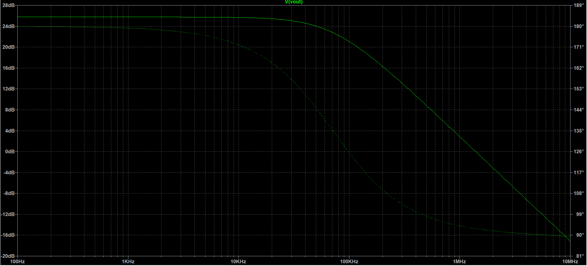
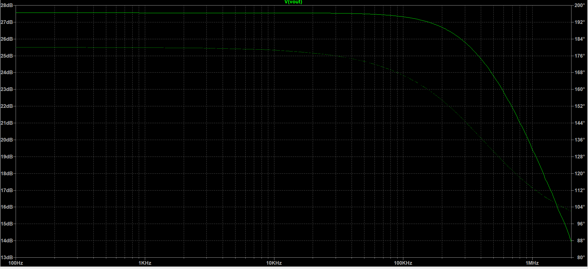

# Cascode Amplifiers Design (22nm & 180nm Technology)

This repository contains a project from my Analog Circuits course(2023), which involves the design and simulation of Cascode Amplifiers using LTSpice with 22nm and 180nm technology nodes. The project explores the frequency response and amplifier behavior across these technologies.

## Project Files:
- **LTSpice Simulations**: `.asc`, `.log`, `.raw` files for each technology.
- **Frequency Response Plots**: PNG images showing the frequency behavior.
- **Documentation**: PDF explaining the design process and results.

## Tools Used:
- LTSpice for circuit simulations.

## Frequency Response Plots:

### 180nm Technology:


### 22nm Technology:


## How to Run Simulations:
1. Clone this repository:  
   ```bash
   git clone https://github.com/ranjeetsohanpal/Cascode-Amplifiers-22nm-180nm.git
